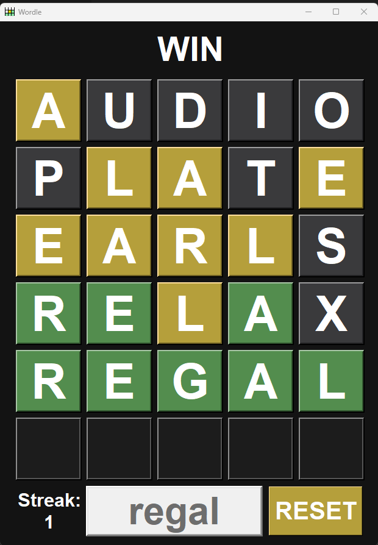

# Wordle Clone

### A replica of the popular NYT browser game, Wordle, as an executable application on your computer.

### Creation date: 1/28/2026

## Features: 

- Retains full functionality of the actual Wordle game.
- Tracks your consecutive wins with a streak counter.
- Uses a built-in 13,000-word dictionary—the same used in the official Wordle.
- Includes a ready-to-use executable file for Windows users.

## How to run: 

1. Download the `Wordle.exe` file.
2. Double-click to run. No setup or extra files required!

*Note: If Windows Defender flags the .exe as suspicious, it is a false positive common with PyInstaller.*

## For developers:

If you want to run the Python script directly:

1. Ensure you have Python 3.x installed.
2. Download the repository.
3. Ensure the `assets` folder, `wordle_gui.py`, and `wordle_logic.py` are in the same directory,.
4. Execute the main GUI script: wordle_gui.py

*Note: This project uses tkinter, which is included in the Python standard library.*

### Project Structure:

- `wordle_clone.exe`    &nbsp;&nbsp;&nbsp;&nbsp;&nbsp;# The full packaged game
- `wordle_gui.py`       &nbsp;&nbsp;&nbsp;&nbsp;&nbsp;&nbsp;&nbsp;&nbsp;&nbsp;&nbsp;# Game visuals
- `wordle_logic.py`     &nbsp;&nbsp;&nbsp;&nbsp;&nbsp;&nbsp;&nbsp;# Game logic
- `assets/`
    - `words.txt`       &nbsp;&nbsp;&nbsp;&nbsp;&nbsp;&nbsp;&nbsp;&nbsp;# Possible random selection
    - `guesses.txt`     &nbsp;&nbsp;&nbsp;&nbsp;&nbsp;# All accepted user-inputted words
    - `logo.png`        &nbsp;&nbsp;&nbsp;&nbsp;&nbsp;&nbsp;&nbsp;&nbsp;# Window icon

## What I learned:

This was my first ever legitimate application beyond just two buttons and a text box. Understanding Tkinter in general as well as finding and iterating on solutions I find online was the biggest aspect of this project. The most annoying part was handling the duplicate letter logic (ensuring yellow vs green highlights match the target word's letter count). Overall, I ended up learning modular organization, stylistic decisions, handling Wordle-specific edge cases, and how to operate within GUI as a whole, and I am very satisfied with what I was able to make within a month of Python.

## Built with:

- Language: Python
- GUI Library: Tkinter
- Packaging: PyInstaller (for the .exe creation)